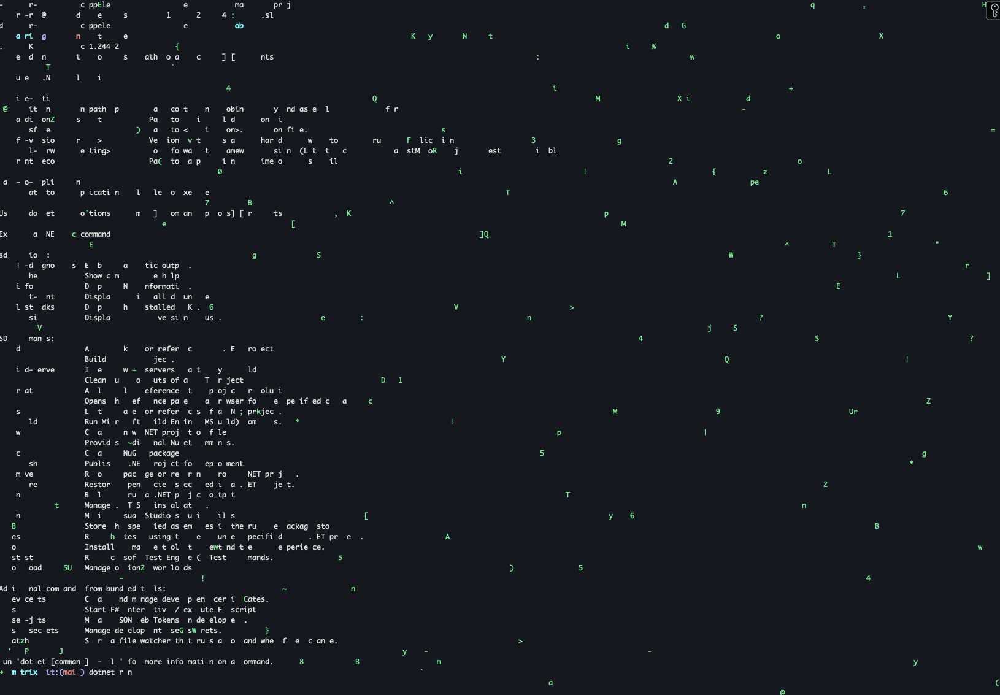

# 🖥️ Matrix Console Animation 🎭

Very simple Matrix Rain project 👾

## 📜 Description

This fun little test project creates a Matrix-like animation in your console window, reminiscent of the iconic "digital rain" from The Matrix films. It's a fun way for me to test .NET 9 release candidate in a minimal way, using the `System.CommandLine` package. Should be cross platform, but tested on macOS Sequoia.

## ✨ What is this?

- 🌧️ Simulates the "digital rain" effect
- 🎨 Green text on black background for that authentic Matrix look
- 🔄 Continuous animation until manually stopped
- 🧹 Option to clear the console on exit

## 🛠️ Technologies

- 💻 C# 
- 🔷 .NET 9 (Release Candidate)
- 📊 System.CommandLine for parsing command-line arguments

## 🚀 Getting Started

1. Clone this repository
2. Ensure you have the .NET 9 SDK installed
3. Run the project using `dotnet run`
4. Use `Ctrl+C` to exit the animation

## 🎮 Usage
Use argument `--clear` to clear the console after exiting (CTRL + C)